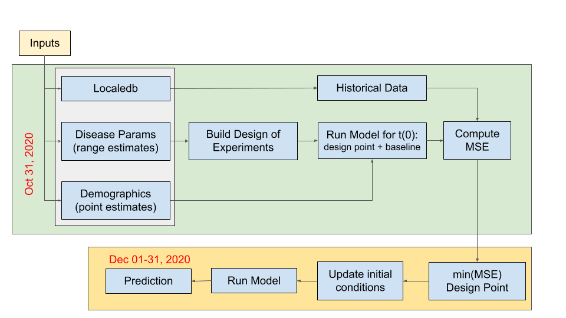

# Enhanced SEIRS+ (E-SEIRS+):<br> A Generalized Infectious Disease Model

## Contents
- [Objective](#objective)
- [Background](#background)
- [Model Process](#model-process)
- [Further Reading](#further-reading)
- [Quick Start](#quick-start)
- [Output Description](#output-description)
- [License](#license)
- [Appendix](#appendix)


### Objective
Re-engineer an existing open source epidemiological model to simplify input parameter value selection for general modelers while maintaining model efficacy. Automate verification, validation, uncertainty quantification, and sensitivity analysis of the model by leveraging LocaleDB, a database of global locales to support modeling and simulation in epidemiology with the current focus on the COVID 19 pandemic.


### Background
At the December 2020 World Modeler Exercise our Ethiopian partners expressed a need for a COVID prediction model in CauseMos. This effort aims to meet that need by enhancing the SEIRS+ model with a method to predict model parameters with readily available data. Additionally, this effort aims to assess the extent to which the ASKE structured data project, LocaleDB, may be used to automate model assessment.

This open source implementation of SEIR is a standard compartmental model in which the population is divided into susceptible (S), exposed (E), infectious (I), recovered (R) and fatality (F) individuals. See[Further Reading](#further-reading) for more detail.

## Model Process
SEIRS+ requires eleven input parameters that are described in the [Appendix](#appendix). We developed a two-stage model calibration method to select appropriate parameters for model assessment.

<center>

</center>

CLI Example: `python3 seirs.py -iso2=ET -startDate=2020-11-01 -endDate=2020-11-30 -simDays=31`

1. Read in modeler input parameters
2. Access localedb and download historical time series data for region of interest; data include disease case and fatality counts.
3. With `Disease Params` ranges, build a Design of Experiments consisting of 17 design points.

For training data (ex: -startDate=2020-11-01 -endDate=2020-11-30 for Ethiopia '-iso2=ET'): 

4. Instantiate model for each design point with input parameters from DOE and `Demographics` point estimates.
5. Compare each model output to ground-truth historical data by computing the mean-squared error.

Time horizon auto-incremented: (ex: -startDate=2020-12-01 -endDate=2020-12-31 [`startDate` + `simDays`]) 

6. Pull the design point(s) that resulted in the min MSE for `cases` and `fatalities` respectively.
7. Update the initial conditions (ground truth `case` and `fatality` count) for t(0) 
8. Run model with new intial conditions and min(MSE) design point parameters.

### Further Reading:
- For further discussion of this implementation, see the google doc at [HERE](https://docs.google.com/document/d/1fgOCZBjfO7Yw3_f-yHGdOtLBg1hmeMWYVFY_zqTYwW4/edit?usp=sharing)
- The original SEIRS+ repository is [HERE](https://github.com/ryansmcgee/seirsplus)

### Quick Start

#### Historical Data:

You can get you historical data by two methods:

  1. localedb: a comprehensive database that provides, among other things, timely case and fatality disease counts

     - run `git clone git@github.com:momacs/localedb.git`
  
     - run `cd localedb`
  
     - run `./build-docker.sh`
  
     - run `docker-compose up -d` This will take about 1 minute

     - Wait until prior step completes, then initialize the database inside the container with, run `docker-compose run --rm localedb setup`

     - run `docker-compose run --rm localedb load dis COVID-19` This will take several minutes to load all the disease data for all locales

     - run `git clone git@github.com:jataware/seirsplus.git`
  
     - run `cd localedb`
     
     - run `pip3 install -r requirements.txt`
  
     - run `python3 historical_data.py -username=<username> -password=<password> -iso2=ET` where `iso2` is the two-letter country code or US State abbreviation. You can request credentials by e-mailing me at: `travis'at'jataware.com`

     - The required `history.csv` file will be written to `~/procedures/{iso2}/inputs/`

  2. "Bring your own data": If you choose this option, see below for formatting requirements.

     - Inspect the `seirsplus/procedures/ET/data/history.csv` for proper format. 
  
     - The counts are cumulative counts of cases and fatalities, not daily case/fatality counts.

     - Required Column Headers: `date,state,positive,death` where:
       - `date` = string in `YYYY-MM-DD` format
       - `state` = string ISO2 code of your location
       - `positive` = integer or float number of cumalitive cases
       - `death` = integer or float number of cumulative deaths

     - Name your BYOD file as `history.csv` and save to the `~procedures/{iso2}/inputs/` folder


#### Run E-SIERS+ via published Docker Image:

For a location of your choosing, after cloning the repository (see Ethiopia Example below):

1. Copy the `~ET/` directory and paste into same directory (`procedures`)
2. Rename folder to `<your iso2>`
3. run `cd <your iso2>`
3. Update all values in the `model_parameters.json` as discussed below for the Ethiopia example. 

Ehiopia Example:

1. run `git clone git@github.com:jataware/seirsplus.git`
3. run `cd seirsplus/procedures/ET/inputs`
4. Open the `model_parameters.json` file. The pre-populated values are estimates from November 2020; make any needed adjustments based on new information. 

Note: The`model_parameters.json` files will be mounted to your Docker container. See the Apendix or Further Reading for detailed descriptions of the parameters.

 Description of `model_parameters.json` :

| Key                                            | Description                                                                                            |
| ---------------------------------------------- | ------------------------------------------------------------------------------------------------------ |
| "ISO" | Two-Letter ISO CODE for country (ex: "ET" ; if for US State, two-letter state abbreviation (ex: "OR)|
| "ADMIN" | Admin-level of your location (ex: "ET"::admin0, "OR"::"admin1" |
| "Parameter Point Estimates" | Point estimate (ex: "initn": 114963588 which is the total population for Ethiopia)|
| "DOE Parameter Ranges" | Range of reasonable parameter values (ex: "r0": [0.8, 3.0, 1] where 0.8=low estimate, 3.0=High estimate, 1= number of decimals desired |

5. Return to the top directory (`seirsplus`)
6. run 

```
docker run -v $PWD/procedures/ET/inputs:/seirsplus/procedures/ET/inputs -v $PWD/procedures/ET/results:/seirsplus/procedures/ET/results jataware/seirsplus -iso2=ET -startDate=2020-11-01 -endDate=2020-11-30 -simDays=31           
```

 where:
  
  - iso2= Two-letter country code or US State abbreviation
  
  - startDate= Date to start training the model 
  
  - endDate= Date to stop training the model
  
  - simDays= Number of days to run prediction using parameters tuned from historical data between the startDate and endDate

7. Model results will be on your local machine at `~/procedures/{iso2}/inputspredictedResults.csv`

#### Run local E-SEIRS+ Model

Steps on how to run the `Ethiopia Procedure`. There is also an example for the State of Oregon (`seirsplus/procedures/OR/`). Should you wish to run E-SEIRS for a different location; the steps are the same, but you need to update the `ET/inputs/model_parameters.json` file with your locations' parameter values.

1. run `git clone git@github.com:jataware/seirsplus.git`

2. run `cd ~seirsplus`

3. run `pip install -r requirements.txt`

4. run `cd ~seirsplus/procedures/ET/inputs`

5. Run localedb or bring your own historical data; see `Historical Data` section above for instructions.

6. Open the `model_parameters.json` file. The pre-populated values are estimates from November 2020; make any needed adjustments based on new information. 

NOTE: for a location of your choosing, all values will need to be updated. See the Apendix or Further Reading for detailed descriptions of the parameters.

Example `model_parameters.json`:

| Key                                            | Description                                                                                            |
| ---------------------------------------------- | ------------------------------------------------------------------------------------------------------ |
| "ISO" | Two-Letter ISO CODE for country (ex: "ET" ; if for US State, two-letter state abbreviation (ex: "OR)|
| "ADMIN" | Admin-level of your location (ex: "ET"::admin0, "OR"::"admin1" |
| "Parameter Point Estimates" | Point estimate (ex: "initn": 114963588 which is the total population for Ethiopia)|
| "DOE Parameter Ranges" | Range of reasonable parameter values (ex: "r0": [0.8, 3.0, 1] where 0.8=low estimate, 3.0=High estimate, 1= number of decimals desired |

7. run `cd ~seirsplus/procedures/ET/`

8. run `python3 seirs.py -iso2=ET -startDate=2020-11-01 -endDate=2020-11-30 -simDays=31` where:
  
  - iso2= Two-letter country code or US State abbreviation
  
  - startDate= Date to start training the model 
  
  - endDate= Date to stop training the model
  
  - simDays= Number of days to run prediction using parameters tuned from historical data between the startDate and endDate

### Output Description
1. run `cd seirsplus/procedures/ET/results/`
2. The model results are written to `predictionResults.csv`
3. There are two versions of `predictionResults.csv`:

  - If historical data is available for your prediction time period, the following headers are included:
  
  `timestamp,admin0,actualCases,predictedCases,actualFatalities,predictedFatalities`
  
  - If your prediction time period extends beyond the available historical data, the following headers are included (no `actual` columns):
  
  `timestamp,admin0,predictedCases,predictedFatalities`

4. To explore your results, there is a jupyter notebook at: `~seirsplus/notebooks/`
5. Open `plotResults.ipynb`, update the file path to your `predictionResults.csv` file, and run the cells to visualize the model results.


### License
1. SEIRS Model MIT License information is [HERE](https://github.com/ryansmcgee/seirsplus/blob/master/LICENSE).


### Appendix
| Parameter | Parameter Description                                    |
| --------- | -------------------------------------------------------- |
| sigma     | Rate of progression: inverse of incubation period     |
| gamma     | Rate of recovery: inverse of infectious period           |
| R0        | Contact infection                                        |
| xi        | inverse of temporary immunity period; 0 if permanent immunity|
| mu\_I     | rate of infection-related mortality                      |
| mu\_0     | rate of baseline mortality                               |
| nu        | rate of baseline birth                                   |
| theta     | rate of testing of individuals                           |
| psi       | probability of positive tests for exposed individuals    |
| initN     | initial total number of individuals                      |


